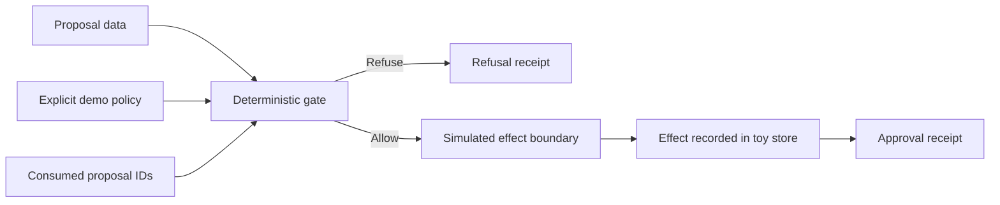

# Recruiting Toy Flow

This diagram describes only the public recruiting demonstrator.

The proposal is never treated as execution authority. A refused proposal stops before the simulated effect boundary. An approved proposal may materialize one in-memory effect; a repeated proposal ID is then refused.
