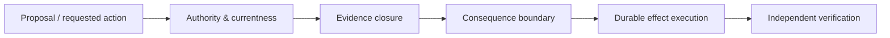

# JCEE Labs — Public-Safe Career Portfolio Systems Map

This is a high-level responsibility map already cleared for the career-facing public portfolio. It intentionally omits proprietary implementation detail.

Public role descriptions:

- **JCEE VOW** — private execution-assurance runtime focused on durable effect identity, recovery, retry judgment, idempotent behavior, evidence journaling, and operational replay.
- **QCS 2.0** — frozen authority/currentness and transition-legality research framework.
- **JEC + JCEE Assurance** — portable evidence structure and deterministic independent verification.
- **Agentic AP Gate** — current product architecture applying these responsibilities to AI-proposed vendor-payment workflows while leaving payment credentials, rails, fraud/risk, and provider controls with the provider.

Claim boundary: this diagram is architectural and descriptive. It is not a production-certification, universal-correctness, regulatory-compliance, or live-partner claim.
