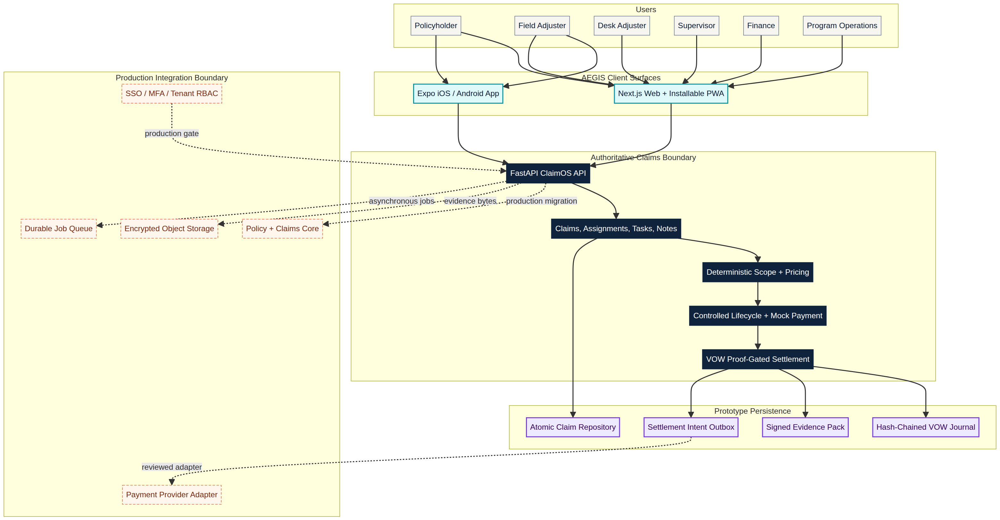

# AEGIS ClaimOS Product and Market Specification

**Author:** Manus AI

**Status:** Build specification for the production-shaped MVP

## Product decision

AEGIS ClaimOS should be marketed first to **mid-market property managing general agents (MGAs) and third-party administrators (TPAs) that administer a defined homeowners program under delegated authority**. The carrier should participate as an approval stakeholder. This segment combines an accessible operating buyer, measurable claim-volume pain, carrier audit pressure, and a bounded workflow that can be piloted without replacing a core claims platform.

The first adjacent market is **independent property-adjusting and catastrophe-response networks**. Their distributed field workforce creates immediate demand for mobile evidence capture, standardized scopes, clean-file quality assurance, and carrier-visible audit records. Restoration and managed-repair networks are the next expansion segment.

AEGIS is not positioned as autonomous coverage adjudication or as a replacement for policy, core-claims, estimating, accounting, or payment systems. It is the **evidence-to-authorization operating layer** around those systems.

## Buyer ranking

| Rank | Segment | Score | Best economic buyer | Why the segment buys |
| ---: | --- | ---: | --- | --- |
| 1 | Property MGAs and TPAs with a defined homeowners program | 78/100 | COO, President, VP Claims Operations | Delegated-authority control, carrier auditability, operational margin, cycle time, and scalable volume |
| 2 | Independent adjusting and catastrophe-response networks | 77/100 | Owner, COO, VP Catastrophe Operations | Distributed field capture, surge readiness, clean-file quality, estimate consistency, and carrier reporting |
| 3 | Multi-branch restoration contractors and managed-repair networks | 72/100 | COO, VP Network Operations, CFO | Supplement control, evidence completeness, approval-to-payment speed, warranty records, and provider governance |
| 4 | Claims technology and embedded-insurance platforms | 61/100 | GM Claims Platform, CPO, COO | Property-specific workflow capability, branded intake, operational controls, and partner audit evidence |
| 5 | Self-insured enterprises, municipalities, and risk pools | 56/100 | Chief Risk Officer, Risk Manager, CFO | Retained-loss governance, auditability, structured evidence, and delegated approval controls |

The product is used by more people than the buyer who signs the contract. The operational user base includes policyholders, first-notice-of-loss representatives, field and desk adjusters, supervisors, quality reviewers, finance staff, carrier auditors, restoration vendors, and program administrators.

## Buyer and user jobs

| Persona | Job to be done | AEGIS value message |
| --- | --- | --- |
| MGA/TPA COO or President | Scale a homeowners program without proportional administrative headcount while proving disciplined delegated authority | Standardize the path from intake to settlement-ready evidence without replacing the carrier core |
| Carrier Chief Claims Officer | Improve indemnity control, claimant experience, cycle time, and auditability | Make required proof, human review, exception reasons, and authorization thresholds visible and exportable |
| VP Claims Operations | Reduce evidence chasing, rework, queue aging, inconsistent estimates, and audit retrieval effort | Operate every claim through role-specific queues and measurable service-level controls |
| Field or desk adjuster | Complete a clean, reviewable file without duplicate entry | Capture structured evidence once, use governed pricing, and resolve only exceptions |
| Supervisor or authority approver | Make defensible decisions within delegated authority | Review a consolidated dossier and cross a proof-gated approval boundary |
| Policyholder | Report a loss, provide documents, understand status, and complete requested actions | Use a clear mobile or browser journey without learning insurance-system terminology |
| Finance or audit user | Confirm that authorization conditions were met before payment and reconstruct the decision later | Use signed evidence, event history, payment status, and an exportable claim record |

## Product promise

> AEGIS ClaimOS turns fragmented property-loss evidence into a complete, priced, human-reviewed, proof-authorized claim file across web and mobile.

The production-shaped MVP supports the complete demonstrable lifecycle:

1. A policyholder or representative submits first notice of loss and evidence.
2. Operations triages the claim and assigns a field adjuster.
3. The adjuster reviews the assignment and captures field observations from a native mobile application.
4. The backend performs the deterministic scope and pricing calculation.
5. The desk adjuster reviews line items, records notes, and resolves tasks.
6. A supervisor authorizes settlement through the immutable VOW proof boundary.
7. Finance schedules the payment instruction.
8. Operations closes the claim with a complete activity history and signed evidence access.

## Supported roles

| Role | Primary surfaces | Allowed actions in the MVP |
| --- | --- | --- |
| Policyholder | Responsive web/PWA and native app | Submit loss, review status, inspect requested actions, view claim milestones |
| Field adjuster | Native app and responsive web | View assignments, add field notes, complete inspection tasks, trigger analysis |
| Desk adjuster | Web/PWA | Review dossier, edit line-item quantity/rate, add notes, save review |
| Supervisor | Web/PWA | Review exceptions, authorize settlement through VOW, verify evidence |
| Finance | Web/PWA | Review authorized amount, schedule the payment instruction, mark sent |
| Program administrator | Web/PWA | View portfolio dashboard, workload, service-level indicators, and role-specific queues |

This MVP uses a demo role switcher rather than production identity. Production deployment requires single sign-on, multi-factor authentication, tenant isolation, server-enforced role-based access control, and an external identity provider.

## Product modules

### Operations command center

The command center presents portfolio counts, total open exposure, evidence-readiness rate, approval throughput, queue aging, and adjuster workload. It includes a searchable claim queue with status, severity, owner, insured, loss date, and next action.

### Claim workspace

The claim workspace retains the current detailed evidence, computer-vision overlays, deterministic estimate, line-item adjustments, coverage context, VOW proof gate, signed evidence links, and audit history. It adds assignment, tasks, notes, lifecycle status, payment status, and a persistent next-action panel.

### Policyholder experience

The policyholder surface provides a plain-language timeline, loss details, requested actions, assigned contact, estimate status, and authorization/payment progress. The responsive web surface is installable as a progressive web app (PWA).

### Native field application

The Expo application supports iOS, Android, and web development. Its first release provides a role-aware home screen, assigned-claim list, claim details, inspection checklist, field-note capture, API-backed demo claim creation, and a local offline action queue stored with AsyncStorage. Native app-store submission is intentionally separate because it requires the user's Apple and Google developer accounts and signing credentials.

### Assurance and payment controls

Settlement approval remains server-calculated and proof-gated. The finance step records a payment instruction only after the claim reaches `APPROVED`. The MVP does not transfer money. A production payment adapter must implement provider idempotency, callback verification, reconciliation, least-privilege credentials, and a reviewed VOW effect adapter.

## Backend contract

The existing pricing and assurance endpoints remain stable. The platform adds the following contracts:

| Method | Route | Purpose |
| --- | --- | --- |
| `GET` | `/api/dashboard` | Portfolio metrics, status distribution, recent activity, and team workload |
| `GET` | `/api/claims` | Filtered claim queue using `status`, `assignee`, `search`, `limit`, and `offset` |
| `POST` | `/api/demo/reset` | Recreate the complete Kitchen Water Damage demo claim |
| `POST` | `/api/claims/{claim_id}/assign` | Assign or reassign field and desk ownership |
| `POST` | `/api/claims/{claim_id}/tasks` | Add a claim task with owner, due date, and priority |
| `POST` | `/api/claims/{claim_id}/tasks/{task_id}/complete` | Complete a claim task and append an audit event |
| `POST` | `/api/claims/{claim_id}/notes` | Add a timestamped role-aware note |
| `POST` | `/api/claims/{claim_id}/status` | Move through controlled non-financial workflow states |
| `POST` | `/api/claims/{claim_id}/payment` | Schedule or send a mock payment instruction after approval |
| `GET` | `/api/team` | Return demo users and workload counts for assignment interfaces |

The JSON repository remains appropriate only for the demonstrable single-process MVP. A production launch must move claim state to PostgreSQL, store evidence bytes in object storage, add database migrations, and use transactions for assignment, authorization, payment, and audit writes.

## Web and app delivery options

| Approach | Tradeoffs | Cost | Setup Complexity |
| --- | --- | --- | --- |
| Responsive web app with installable PWA only | Fastest deployment and one codebase; covers desktops, tablets, and home-screen installation, but has weaker native camera, background, and app-store integration | Lowest | Low |
| **Responsive web/PWA plus Expo native app** | Best fit for policyholders, desk teams, and field adjusters; requires maintaining two clients and separate app-store release processes | Moderate | Moderate |
| Full enterprise deployment with PostgreSQL, object storage, identity, queues, and provider adapters | Required for production scale, catastrophe volume, regulated access control, and external effects; adds security, infrastructure, support, and integration work | Highest | High |

This build implements the second approach because the user requested both browser and regular-app usage. The first approach remains a lighter deployment path, and the third is the production hardening path.

## Design system

AEGIS uses a high-contrast operational design: deep navy for trust and command surfaces, bright cyan for active workflow, safety orange for exceptions and consequential decisions, and warm paper for evidence-heavy work. The shield-check signature mark must appear in every web view and native screen header. Interfaces use compact, scannable cards, explicit status labels, readable data tables, and no color-only status communication.

## Pilot offer

The launch offer is a paid, fixed-scope **8–12 week Homeowners Evidence-to-Authorization Pilot** with one MGA/TPA program and carrier sponsor. It covers one state, peril, catastrophe cohort, or claim class. It keeps the incumbent claims core, policy system, estimating estate, and payment rail as systems of record.

Pilot measures should include evidence completeness, evidence-ready-to-authorization time, adjuster touches, exception and override rate, rework or supplements, audit-file retrieval time, field adoption, claimant completion, and service-level timing. Coverage and payment authority remain with the authorized carrier or delegated claims organization.

## Production gates

The MVP deliberately does not claim legal compliance, autonomous coverage decisions, real payment execution, or catastrophe-scale resilience. A production release requires customer-specific legal review, state and program configuration, single sign-on, multi-tenant role enforcement, encrypted object storage, retention controls, access logs, monitored queues, disaster recovery, provider reconciliation, offline conflict handling, security testing, and capacity testing.

## References

[1]: https://content.naic.org/sites/default/files/model-law-902.pdf "NAIC Unfair Property/Casualty Claims Settlement Practices Model Regulation"
[2]: https://kpmg.com/us/en/articles/2025/property-casualty-rising-complexity.html "KPMG Property and Casualty: Rising Complexity"
[3]: https://www.deloitte.com/us/en/insights/industry/financial-services/financial-services-industry-outlooks/insurance-industry-outlook.html "Deloitte 2026 Global Insurance Outlook"
[4]: https://eberls.com/catastrophe-claims-management/ "Eberl How Carriers Are Rethinking Catastrophe Claims Management"
[5]: https://agents.floodsmart.gov/topics/flood-insurance-adjuster "FEMA National Flood Insurance Program Insurance Adjusters"
[6]: https://www.restorationindustry.org/restoration-blog/5-ways-restoration-contractors-can-improve-their-inputs-get-better-outputs-ai "Restoration Industry Association Guidance on Better Claims Inputs"
[7]: https://www.verisk.com/products/xactimate/ "Verisk Xactimate Property Claims Estimating Software"
[8]: https://www.bcg.com/publications/2025/embedded-insurance-success-get-your-tech-stack-right "BCG Embedded Insurance Success: Get Your Tech Stack Right"
[9]: https://app.leg.wa.gov/rcw/default.aspx?cite=48.62&full=true "Washington State Local Government Insurance Transactions"
