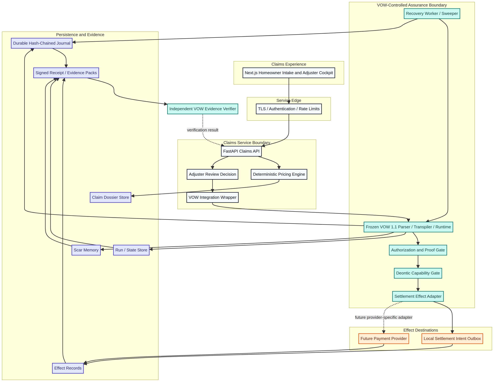

# VOW 1.1 Integration for Aegis ClaimOS

**Author:** Manus AI

**Status:** Implemented prototype integration

**Scope:** Settlement authorization, durable effect evidence, and recovery

## Executive conclusion

The supplied VOW 1.1 correction package is best used as an **assurance boundary around consequential settlement actions**. It should not replace the deterministic pricing engine. Pricing remains ordinary FastAPI application logic. VOW receives the server-calculated estimate and the human review decision, proves the required settlement invariants, executes a keyed settlement-intent effect through its capability gate, records the effect in its hash-chained journal, and exports a signed evidence pack.

The nested frozen release was extracted without source changes. Its declared `CAUSAL-EFFECTS-MANIFEST.sha256` passed before integration. The application repeats this manifest verification at startup. A mismatch stops startup rather than silently running modified assurance code.



## Integration choice

Three implementation paths were evaluated. The wrapper path was selected because it adds VOW where the risk is highest without making the pricing engine dependent on a domain-specific orchestration language.

| Approach | Tradeoffs | Cost | Setup Complexity |
| --- | --- | --- | --- |
| Keep the claims service unchanged and attach only an audit note | Lowest effort, but no proof gate, no effect idempotency record, no signed evidence, and no VOW recovery semantics | Lowest | Low |
| **Wrap settlement approval with frozen VOW 1.1** | Preserves the existing pricing engine while adding proof-gated execution, keyed-effect replay protection, a verifiable journal, and signed evidence | Low for the prototype; subprocess overhead per approval | Moderate |
| Run VOW as a separate persistent service backed by PostgreSQL | Stronger operational separation and centralized recovery, but requires authentication, secret management, migrations, monitoring, and production infrastructure | Higher ongoing infrastructure cost | High |

The implementation uses the second path. A corrected local/integration container example for the third path is included under `deploy/vow-reference/`, but it is not represented as production-ready.

## Responsibility boundaries

| Component | Responsibility | Explicitly excluded |
| --- | --- | --- |
| FastAPI pricing engine | Xactimate-style price lookup, regionalization, depreciation, coverage filtering, deductible, and payout calculation | It does not authorize external settlement effects. |
| Adjuster interface | Human review, line-item edits, notes, and the final approval action | It cannot submit trusted aggregate totals or bypass the server calculation. |
| VOW integration wrapper | Render a claim-specific quest, invoke the immutable CLI, verify the journal, export evidence, and retain compact receipt metadata | It does not modify VOW parser, runtime, causal policy, receipt schemas, or verifier code. |
| Frozen VOW 1.1 core | Proof evaluation, capability enforcement, keyed-effect journaling, replay rules, evidence export, and evidence verification [1] [2] | It does not infer insurance coverage, calculate prices, or validate provider truth. |
| Settlement effect adapter | The prototype writes a deterministic settlement-intent receipt to a local outbox | It does not move money. A provider-specific, reviewed adapter is required before payment execution. |
| Recovery worker | Run the supported VOW sweeper on a configurable interval and stop cleanly on process signals [1] | It never auto-grants human approvals. |

## Approval execution flow

An `APPROVE` request first causes the backend to recalculate every line and aggregate. The backend then generates a VOW quest with beliefs derived from the claim dossier and the human action. The quest proves that analysis is complete, coverage is confirmed, at least one covered item has positive replacement cost, gross replacement cost is positive, payout is nonnegative, payout does not exceed actual cash value, the deductible is nonnegative, and the human approval flag is true.

Only after those proofs pass does the quest invoke `file_write` through a declared VOW capability. The call carries one versioned settlement-authorization key per claim. VOW consults prior completed keyed effects before execution. An exact retry produces an `idempotent_replay` journal result instead of writing the same effect again. Reuse of that claim key with a changed estimate, adjuster, or review-note digest fails loudly under the frozen runtime policy.[1]

The backend approves the claim only after all of the following are true:

1. VOW returns a successful quest trace.
2. The settlement-intent receipt exists and matches the expected authorization digest.
3. The VOW journal verifies as an intact hash chain.
4. A scoped `vow-evidence-pack/1` file is exported.
5. The evidence fingerprint and Ed25519 signature verify against the deployment's pinned public key.[3]

A failed proof returns HTTP `409` and leaves the claim in `IN_REVIEW`. An assurance runtime or evidence failure returns HTTP `503` and also leaves the claim unapproved.

## Evidence exposed to the claims workflow

The approved dossier stores compact assurance metadata. It includes the VOW version, quest name, run identifier, authorization digest, estimate digest, frozen-core manifest digest, journal head, event count, effect outcome, evidence fingerprint, signing-key identifier, and verification status. Review notes are represented in the VOW effect payload by a SHA-256 digest rather than duplicated as clear text.

| Endpoint | Purpose |
| --- | --- |
| `GET /api/claims/{claim_id}/assurance/evidence` | Download the signed evidence pack for the approved settlement. |
| `GET /api/claims/{claim_id}/assurance/verify` | Re-run VOW's independent evidence verifier against the pack and pinned public key. |
| `GET /health` | Report the frozen VOW version, verified file count, and manifest digest with service health. |

The frontend approval screen exposes both evidence actions. It also displays the VOW run identifier, journal event count, and authorization receipt digest.

## Persistence and recovery

The prototype keeps claim JSON storage separate from VOW assurance storage. VOW uses its own SQLite run registry and journal under `backend/.data/vow/` by default. Generated quests, effect receipts, signed evidence packs, and the signing seed are stored in distinct subdirectories. The signing seed is created with owner-only file permissions unless `VOW_ED25519_KEY` is supplied by the environment.

The root launcher starts a third, persistent process for `vow sweep`. Its interval is configured through `VOW_SWEEP_INTERVAL_SECONDS`. The worker uses VOW's heartbeat and stale-run rules. It logs each sweep and handles `SIGINT` and `SIGTERM` without relying on container restarts as a scheduler.[1]

For a multi-host deployment, SQLite and the claims JSON file are not sufficient. The included reference stack demonstrates VOW with PostgreSQL and readiness-gated startup. The claims service itself still requires a database migration before it can safely scale beyond one process.

## Frozen-core preservation

The entire supplied core is vendored under `vendor/vow-1.1/`. No frozen source, test, manifest, verifier, receipt schema, causal model, or decision table was changed. JCEE Labs integration code is limited to these successor layers:

| Path | Purpose |
| --- | --- |
| `backend/vow_assurance.py` | Claims-to-VOW adapter, proof quest generation, evidence export, and verification |
| `backend/vow_worker.py` | Local recovery worker wrapper |
| `deploy/vow-reference/` | Corrected reference container and PostgreSQL stack |
| `docs/vow-claims-architecture.*` | Corrected architecture source and rendering |

## Honest limitations and production gates

This prototype does not claim legal compliance, complete causal truth, or production payment safety. Hashes prove which source and evidence were evaluated; they do not prove that an external authority reported truthfully. The frozen VOW documentation names this boundary explicitly.[2]

Before connecting a real payment provider, the next gate is a provider-specific effect adapter with reviewed schemas, provider idempotency semantics, authoritative status reconciliation, credential isolation, webhook or callback validation, adversarial state tests, and crash-window chaos tests. The public VOW API must also sit behind authentication, authorization, transport security, rate limits, and audit controls. Signing keys must move to managed secret storage, and public keys must be published through an independent trust channel.

The corrected reference Compose stack is suitable for local or controlled integration testing. It uses placeholders instead of embedded credentials, waits for PostgreSQL readiness, runs one long-lived recovery worker, includes a health check, and verifies the frozen manifest during image construction. Production topology still requires separate review for availability, backup, restore, observability, and least-privilege networking.

## Verification commands

```bash
# Frozen core integrity
cd vendor/vow-1.1
sha256sum -c CAUSAL-EFFECTS-MANIFEST.sha256

# Backend and VOW wrapper tests
cd ../..
uv run --project backend pytest backend/tests

# Frontend validation
pnpm --dir frontend typecheck
pnpm --dir frontend build

# Corrected reference stack configuration
cp deploy/vow-reference/.env.example deploy/vow-reference/.env
# Replace every placeholder before running:
docker compose --env-file deploy/vow-reference/.env \
  -f deploy/vow-reference/docker-compose.yml config
```

## References

[1]: https://github.com/jonchadbourne21-rgb/jcee-labs-website/blob/feat/ai-claims-platform/vendor/vow-1.1/docs/DURABILITY.md "VOW 1.1 Durability Contract"
[2]: https://github.com/jonchadbourne21-rgb/jcee-labs-website/blob/feat/ai-claims-platform/vendor/vow-1.1/docs/CAUSAL_EFFECTS.md "VOW Causal-Effect Retry Gate"
[3]: https://github.com/jonchadbourne21-rgb/jcee-labs-website/blob/feat/ai-claims-platform/vendor/vow-1.1/vow/evidence_pack.py "VOW Signed Evidence Pack Implementation"
