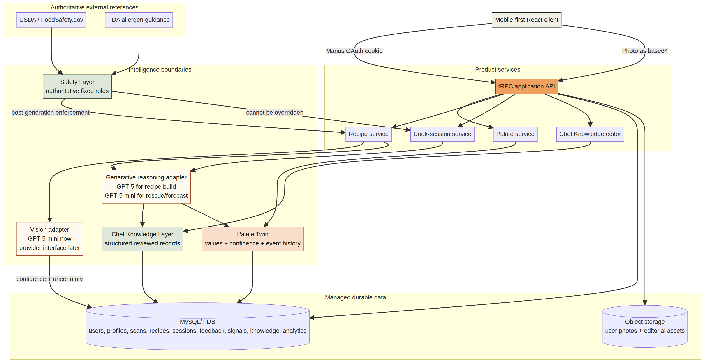

# Mise — Architecture, Safety, and Cost Model

**Author:** Manus AI  
**As of:** 12 September 2026

## 1. Architectural decision

Mise is implemented as a managed full-stack web application because the MVP requires durable user identity, a relational database, private object storage, server-side AI credentials, and a mobile-first interface. A static or local-only prototype would reduce setup but could not honestly validate persistence, real photo storage, account isolation, or the learning loop.

The stack is React 19, TypeScript, Tailwind CSS, Express, tRPC, Drizzle ORM, MySQL/TiDB, managed object storage, and Manus OAuth. This choice optimizes rapid iteration and low operational burden. The principal tradeoff is portability: the application code is standard TypeScript, but authentication, storage helpers, and deployment are coupled to the managed platform and would require adapters for another host.

## 2. Layer boundaries

| Layer | Owns | Must not own |
|---|---|---|
| Client | Capture, correction, navigation, Cook Mode controls, visual state | Provider credentials, authoritative safety decisions, database writes outside tRPC |
| Product API | Authentication, validation, orchestration, persistence | Unstructured client trust or direct model output as truth |
| Vision adapter | Ingredient/dish candidates, confidence, uncertainty | Confirmation or final recipe facts |
| Nutrition reference adapter | Live USDA FoodData Central matches, per-100 g values, portion scaling, labeled fallback | Medical advice, exact portion truth, package-label equivalence |
| Generative reasoning adapter | Options, recipe structure, substitution, forecast, recovery | Authoritative temperatures, allergen guarantees, user identity |
| Chef Knowledge | Reviewed technique, ingredient, cut, error, recovery, sensory records | Arbitrary per-user prose or authentication logic |
| Palate Twin | Current values, confidence, historical signals | Recipe safety or irreversible preference overwrites |
| Safety | Fixed sourced requirements and deterministic attachment | Taste preference or generated culinary creativity |
| Storage | User photos and editorial images | Binary data in relational rows |
| Relational data | Typed user, scan, nutrition goal/log, semantic memory/edge, recipe, session, feedback, knowledge, and event records | Image bytes or opaque generated documents as the primary model |

## 3. Data and request flow

A photo arrives as a validated JPEG, PNG, or WebP data URL. The server rejects unsupported or oversized input, uploads bytes to object storage, and sends the same content to the vision adapter. The vision result is stored with confidence and uncertainty. The user confirms or corrects it before any option is generated.

A confirmed scan, Palate Twin, equipment list, restrictions, and time limit are sent to the option model. The selected option then goes to the stronger recipe model with Chef Knowledge context. The resulting JSON must pass a strict schema. The server discards unknown safety IDs and deterministically attaches relevant authoritative safety records. Every later recovery receives the current recipe and those fixed records.

Meal feedback updates the current preference estimate through a bounded deterministic function. It also writes an immutable signal record containing the before and after values. This preserves history and allows the model to be re-estimated later.

Food Lens follows a separate evidence path. Vision proposes visible food identities and edible mass estimates. The server normalizes food names, queries USDA FoodData Central, validates candidate lexical overlap, scales per-100 g nutrients to estimated grams, and labels every source. A dedicated `USDA_FDC_API_KEY` is preferred; USDA's public demo key is attempted when absent, with a labeled local reference fallback on timeout or rate limit. A scan does not count toward daily nutrition until the user explicitly logs it as eaten. Targets are user-selected planning preferences and are never described as clinical prescriptions.[4]

Each Food Lens scan, generated recipe, and completed-meal feedback record is encoded into a deterministic 64-dimensional user-scoped semantic vector. Cosine retrieval selects related memories and typed edges record the strongest links. Recipe generation receives only the authenticated user's retrieved memories, with visible provenance; memory content is preference evidence, never food-safety or medical evidence. One-tap plate-to-recipe generation is idempotent per Food Lens scan and stores a direct provenance link.

## 4. Structured contracts

A recipe is not stored as markdown. Its top-level fields include title, summary, rationale, source ingredients, ingredients with units and allergen labels, equipment, ordered mise en place, cooking steps, sensory profile, substitutions, authoritative safety records, plating notes, active time, total time, difficulty, version, parent recipe, favorite state, and generation mode.

Each cooking step includes an ID, title, instruction, reason, guide time, temperature where applicable, visual cue, smell cue, texture cue, common mistake, recovery, technique reference, parallel group, and safety rule IDs. This representation supports Cook Mode, accessibility, version comparison, timers, analytics, and future voice without re-parsing prose.

## 5. Model-provider independence

The server isolates model use in `server/product/ai.ts`. Product routers call domain functions rather than provider SDKs. Model availability is checked against the live catalog. Current assignments are GPT-5 mini for vision, options, substitutions, forecasts, and recovery, and GPT-5 with low reasoning for the high-value structured-recipe build. All calls use strict JSON Schema. Conservative deterministic fallbacks preserve the product path when a provider is degraded.

A future provider migration requires implementing the same six domain operations and preserving the shared JSON contracts. Embeddings, image generation, and video generation are not dependencies for the core MVP. Editorial images are pre-generated and cached. Technique video is deliberately deferred.

## 6. Chef Knowledge workflow

The `chef_knowledge` table supports technique, ingredient, cut, error, recovery, sensory-transformation, and safety-adjacent records. Each record has a stable slug, structured content, source metadata, review status, editability flag, and last editor. Public users can inspect the library. The owner role can edit it through the product interface without touching application code.

The seed library includes dry-surface browning, fond and deglazing, chicken-thigh crispness, julienne, brunoise, thin-sauce diagnosis, rapid-browning recovery, lemon sensory transformation, and extended roasting. These examples are deliberately representative rather than comprehensive. A culinary-trained advisor should review and expand one domain at a time, beginning with poultry, pan sauces, vegetable roasting, and common substitutions.

## 7. Safety architecture

Authoritative minimum temperatures and storage rules come from FoodSafety.gov and USDA guidance. The nine major U.S. allergens and cross-contact boundary come from the U.S. Food and Drug Administration.[1] [2] [3] These records are selected by deterministic code. They are not generated or rewritten by an LLM.

The safety layer attaches poultry at 165°F/74°C, ground meat at 160°F/71°C, whole beef/pork/lamb/veal cuts at 145°F/63°C with a three-minute rest, fish at 145°F/63°C or the published visual standard, and leftovers at 165°F/74°C. Cross-contamination and allergen reminders are attached generally. A post-generation guard adds a correction if generated poultry text suggests a lower Fahrenheit target.

This architecture cannot guarantee safety. Vision can misidentify food, users can measure incorrectly, local rules can differ, and allergen cross-contact can be invisible. The product must continue to label authoritative records, require thermometers where applicable, avoid allergy guarantees, and escalate ambiguous cases rather than improvise.

## 8. Privacy and deletion

Images are stored as opaque object keys. The database stores references, not bytes. Palate signals preserve their source and confidence. The user can delete their Palate Twin, Food Lens and ingredient scans, nutrition goals and logs, semantic memories and edges, recipes, sessions, feedback, signals, and analytics from the profile screen while keeping the authentication account available. The MVP does not sell data, expose a public profile, or train an external model on user records. Any future model-training or aggregated research use requires a distinct opt-in consent and retention policy.

## 9. Inference cost model

The following model uses the live built-in catalog captured on 12 September 2026. GPT-5 mini was priced at $0.25 per million input tokens and $2.00 per million output tokens. GPT-5 was priced at $1.25 per million input tokens and $10.00 per million output tokens. These prices are platform inputs, not contractual future rates.

The base case assumes four completed cooks per monthly active user. Each cook uses 11,000 GPT-5 mini input tokens, 3,400 mini output tokens, 6,000 GPT-5 input tokens, and 3,000 GPT-5 output tokens across recognition, options, recipe construction, recovery, and forecast. A 15% retry and variance buffer is applied.

| Monthly active users | Completed cooks/month | Estimated monthly model cost |
|---:|---:|---:|
| 100 | 400 | $21.64 |
| 1,000 | 4,000 | $216.43 |
| 10,000 | 40,000 | $2,164.30 |
| 100,000 | 400,000 | $21,643.00 |

The base model cost is **$0.04705 per completed cook** and **$0.21643 per monthly active user**. This estimate excludes hosting, database, object storage, bandwidth, support, payments, tax, and one-time editorial image generation. The reproducible inputs and calculation are in `docs/cost-model.json` and `scripts/cost-model.py`.

The major economic risk is not the base estimate. It is uncontrolled retries, oversized images, excessive recipe regeneration, long conversational histories, and using the premium model for low-value interactions. The architecture therefore assigns the premium model only to recipe construction, keeps requests structured, stores the result, and uses deterministic safety and learning logic.

## 10. Deployment and operational posture

Development and production use the same Node application. `pnpm build` produces the client and bundled server. The managed default is stateless autoscaling with the database and object store as durable state. No in-memory session or queue is required. Current requests finish within the platform timeout; live generation is synchronous and visibly loading. At higher scale, recipe generation should move to an idempotent job record if p95 latency becomes unacceptable.

Production publication requires a verified build and a saved release checkpoint. The current release has no scheduled work, webhooks, or always-on worker and therefore does not require reserved hosting.

## References

[1]: https://www.foodsafety.gov/food-safety-charts/safe-minimum-internal-temperatures "Safe Minimum Internal Temperatures"
[2]: https://www.fsis.usda.gov/food-safety/safe-food-handling-and-preparation/food-safety-basics/steps-keep-food-safe "USDA FSIS Keep Food Safe"
[3]: https://www.fda.gov/food/nutrition-food-labeling-and-critical-foods/food-allergies "U.S. Food and Drug Administration Food Allergies"
[4]: https://fdc.nal.usda.gov/api-guide "USDA FoodData Central API Guide"
